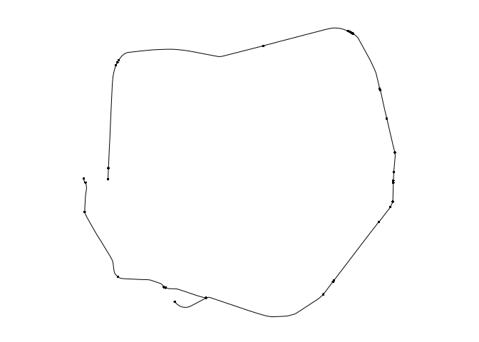
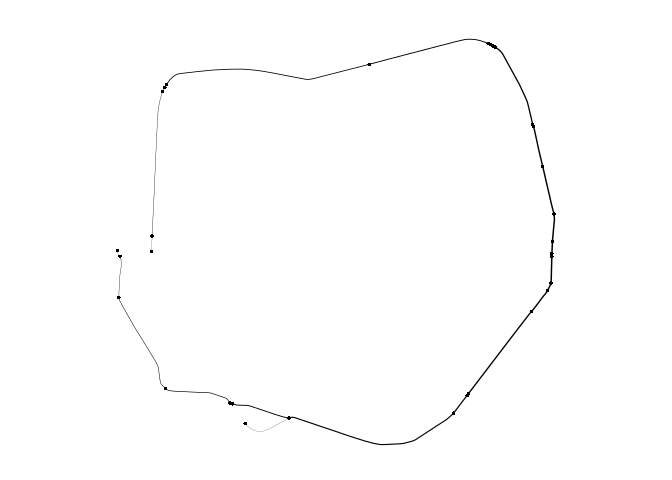
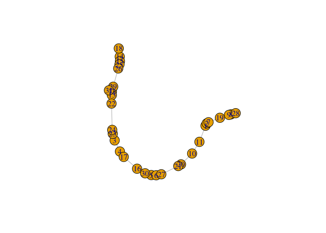
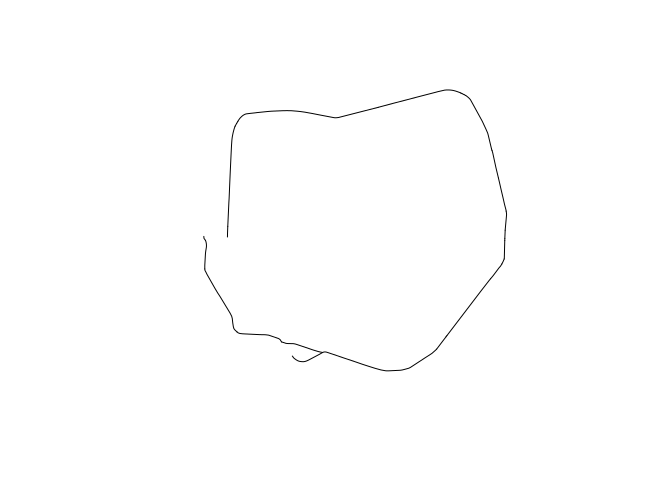

<!-- README.md is generated from README.Rmd. Please edit that file -->

# spnethack

The goal of spnethack is to explore spatial networks in R.

# Requirements

We’ll use the following packages:

``` r
library(sf)
library(osmdata)
library(dodgr)
library(stplanr)
library(dplyr)
library(piggyback)
library(tidygraph)
library(sfnetworks)
```

# Data

It makes sense to have some input data.

## From josm

Data from OSM was downloaded with the `josm` GUI. It can be read-in as
follows:

``` r
pb_download("promenade-all.geojson")
promenade_all = read_sf("promenade-all.geojson")
summary(factor(promenade_all$highway))
promenade_min = promenade_all %>% 
  filter(name == "Promenade")

summary(is_linestring)
promenade_way = promenade_all %>% 
  filter(!is.na(highway)) %>% 
  filter()
# write_sf(promenade_way, "promenade-way.geojson")
# write_sf(promenade_min, "promenade-min.geojson")
```

The minimum dataset can be read-in as follows:

``` r
pb_download("promenade-min.geojson")
#> ✔ Setting active project to '/home/robin/repos/spnethack'
#> All files up-to-date already
promenade_min = read_sf("promenade-min.geojson")
plot(promenade_min$geometry)
```

<!-- -->

A slightly larger dataset can be read-in and plotted as follows:

``` r
pb_download("promenade-way.geojson")
#> All files up-to-date already
promenade_way = geojsonsf::geojson_sf("promenade-way.geojson")
plot(promenade_way$geometry)
```

<!-- -->

``` r
summary(factor(st_geometry_type(promenade_way)))
#> LINESTRING 
#>       2020
is_point = st_geometry_type(promenade_way) == "POINT"
promenade_way = promenade_way[!is_point, ]
promenade_way = st_cast(promenade_way, "LINESTRING")
```

## From osmdata

``` r
promenade_osmdata = opq(bbox = 'Muenster, DE') %>% 
  add_osm_feature(key = 'name', value = 'Promenade') %>% 
  osmdata_sf %>% 
  unique_osmdata()
```

## From dodgr

``` r
muenster = dodgr_streetnet('Muenster, DE')
promenade_dodgr = muenster %>% filter(name == 'Promenade')
```

## Route networks with stplanr

The code to create route network data is in `stplanr-promenade.R`. It
can generate a ‘betweenness’ graph like this:

``` r
source(file = "stplanr-promenade.R")
```

<!-- -->

## Route networks with dodgr

An example of how to create route data from sample points along the
edges can be found `dodgr-promenade.R`, it can also generate a flow
aggregate which is quite similar to the betweenness.

``` r
source(file = "dodgr-promenade.R")
dodgr_flowmap(graph_f, linescale = 5)
```

<!-- -->

To do this we can use all the points in the data 430 points on the `to`
column and the same number on the `from`, and it takes 0.6 sec.

## Route networks with sfnetworks

``` r
p_sfn = sfn_asnetwork(promenade_min)
plot(p_sfn)
```

<!-- -->

``` r
p_graph = sfn_network2graph(p_sfn)
b = igraph::edge.betweenness(p_graph)
plot(p_sfn, lwd = b / mean(b))
```

<!-- -->

### Munster example

``` r
p_sfn = sfn_asnetwork(promenade_way)
plot(p_sfn)
i = sfn_network2graph(p_sfn)
b = igraph::edge.betweenness(i)
p_sfn$edges$b = b
plot(p_sfn, lwd = b / mean(b))
```

## Route networks with spnetwork

## Route networks with osmnx

## Route networks with tidygraph

``` r
rtg = as_tbl_graph(x = rstp@g)
class(rtg)
#> [1] "tbl_graph" "igraph"
length(rtg)
#> [1] 10
rtg$geometry = promenade_min$geometry
plot(rtg)
```

<!-- -->

``` r
plot(rtg$geometry)
```

<!-- -->

``` r

# But fails with subsetting...
rtg_sub = rtg[1:5, ]
rtg_sub
#> 5 x 31 sparse Matrix of class "dgCMatrix"
#>                                                                   
#> [1,]   .      388.3444  .        .       .   .        .      . . .
#> [2,] 388.3444   .       .        .       .   .      663.5711 . . .
#> [3,]   .        .       .       25.28429 .   .        .      . . .
#> [4,]   .        .      25.28429  .       .   .        .      . . .
#> [5,]   .        .       .        .       . 155.1238   .      . . .
#>                                                                           
#> [1,] 6.592897 . . . . .  .       . . . . .  .       . . . . . .  .       .
#> [2,] .        . . . . .  .       . . . . .  .       . . . . . .  .       .
#> [3,] .        . . . . .  .       . . . . . 84.70141 . . . . . .  .       .
#> [4,] .        . . . . . 83.52986 . . . . .  .       . . . . . .  .       .
#> [5,] .        . . . . .  .       . . . . .  .       . . . . . . 87.09183 .
```

## Converting tidygraph into sf objects

``` r
rtg_edges = activate(rtg,edges) %>% mutate(geometry = promenade_min$geometry)

st_as_sf(as.tibble(rtg_edges)) 
```

# Benchmark

``` r
system.time({rnet1 = SpatialLinesNetwork(promenade_way)})
class(rnet1)
system.time({
  rnet2 = sfn_asnetwork(promenade_way)
  i = sfn_network2graph(rnet2)
})
object.size(rnet1)
object.size(rnet2)
```
