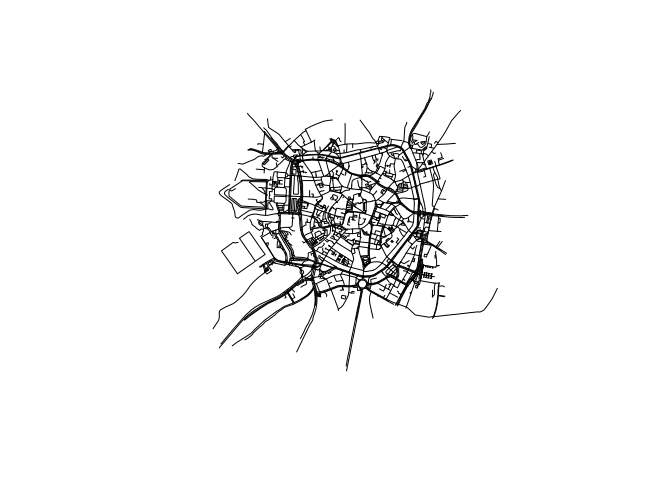

<!-- README.md is generated from README.Rmd. Please edit that file -->

# spnethack

The goal of spnethack is to explore spatial networks in R.

# Requirements

We’ll use the following packages:

``` r
library(sf)
library(osmdata)
library(dodgr)
library(stplanr)
library(dplyr)
library(piggyback)
```

# Data

It makes sense to have some input data.

## From josm

Data from OSM was downloaded with the `josm` GUI. It can be read-in as
follows:

``` r
pb_download("promenade-all.geojson")
promenade_all = read_sf("promenade-all.geojson")
summary(factor(promenade_all$highway))
promenade_min = promenade_all %>% 
  filter(name == "Promenade")
promenade_way = promenade_all %>% 
  filter(!is.na(highway))
# write_sf(promenade_way, "promenade-way.geojson")
# write_sf(promenade_min, "promenade-min.geojson")
```

The minimum dataset can be read-in as follows:

``` r
pb_download("promenade-min.geojson")
#> ✔ Setting active project to '/home/robin/repos/spnethack'
#> All files up-to-date already
promenade_min = read_sf("promenade-min.geojson")
plot(promenade_min$geometry)
```

<!-- -->

A slightly larger dataset can be read-in and plotted as follows:

``` r
pb_download("promenade-way.geojson")
#> All files up-to-date already
promenade_way = geojsonsf::geojson_sf("promenade-way.geojson")
plot(promenade_way$geometry)
```

<!-- -->

## From osmdata (currently not working)

``` r
promenade = opq(bbox = "munster") %>% 
  add_osm_feature(key = "name", value = "Promenade")
```

## Route networks with stplanr

The code to create route network data is in `stplanr-promenade.R`. It
can generate a ‘betweenness’ graph like this:

``` r
source(file = "stplanr-promenade.R")
```

<!-- -->

## Route networks with dodgr

## Route networks with sfnetworks

## Route networks with spnetwork

## Route networks with osmnx
